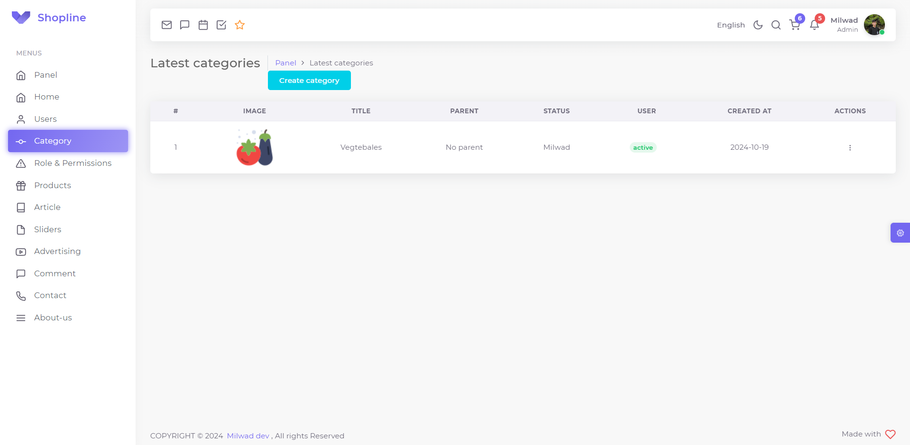

## Introduction
The shopline is an open-source free and advanced eCommerce with [Laravel](https://github.com/laravel/laravel). <br>
Shopline can help you to make your shop easy fast & free. <br>
Shopline helps to tutorial advance Laravel. <br>
Shopline made with Laravel - JS - Bootstrap.

## Features

* Modular architecture
* Custom authentication
* Dynamic menu
* Design Pattern
* SOLID
* Sweetalert
* Toast
* Ajax
* JQuery
* TDD
* Laravel-crod package
* Laravel-validation package
* Laravel-attributes package
* Role permission system
* Use helper
* Module maker command custom
* Gate & Policy
* Many attributes
* Spatie Tags
* [Intervention Image](https://github.com/Intervention/image)
* Test coverage
* Laravel component
* Polymorphic relationships
* Laravel Pint
* PHPStan (Level 7)

## Demos

### Panel Demos

- Category Index


## Run Pint & PHPStan

For convenience, we are define two composer scripts to run `Pint` and `PHPStan`:

```shell
composer pint
composer stan
```

## Contributors
<a href="https://github.com/milwad-dev/shopline/graphs/contributors">
    
</a>

## License
Shopline is an open-source E-Commerce that will always be free under the [MIT License](https://github.com/bagisto/bagisto/blob/master/LICENSE).
